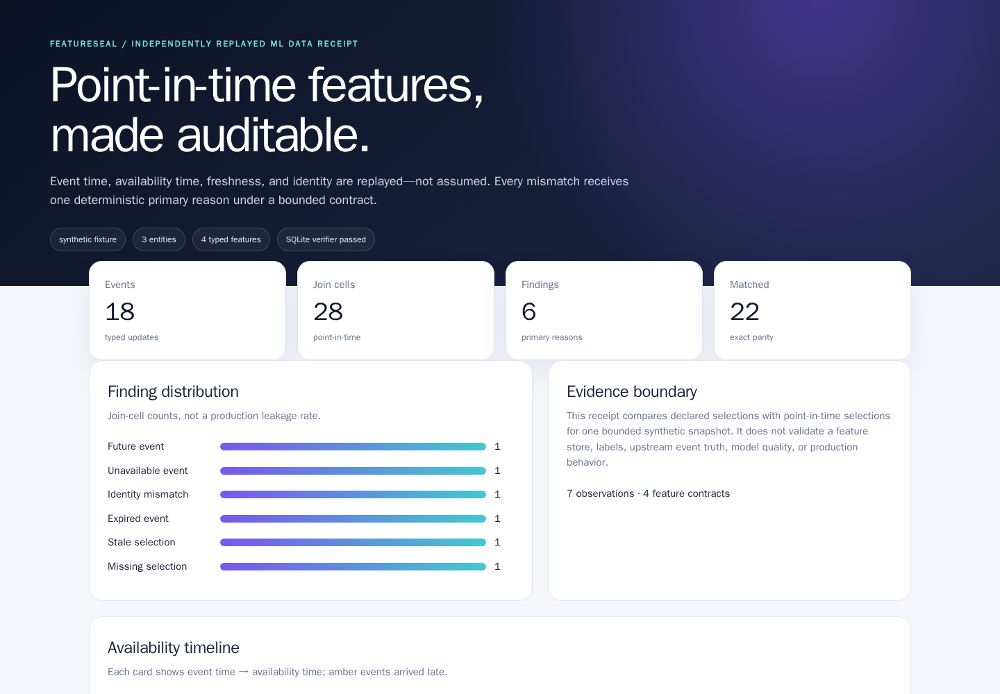
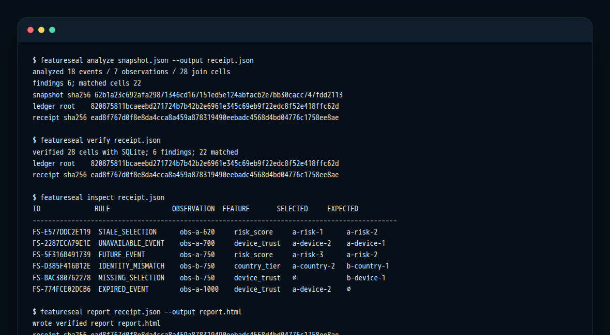
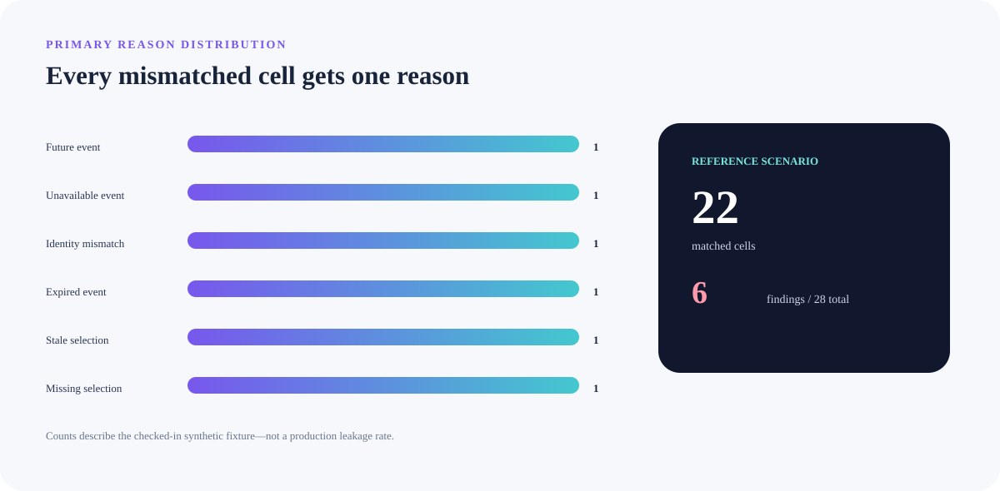
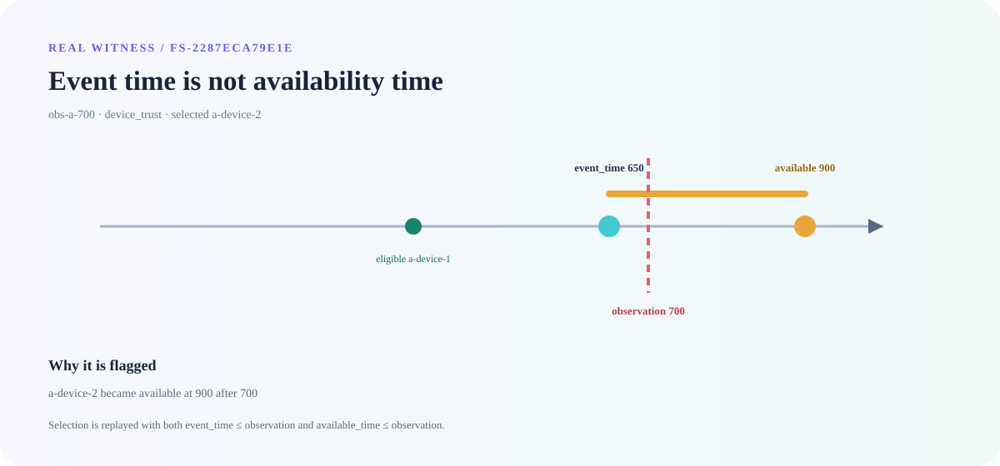
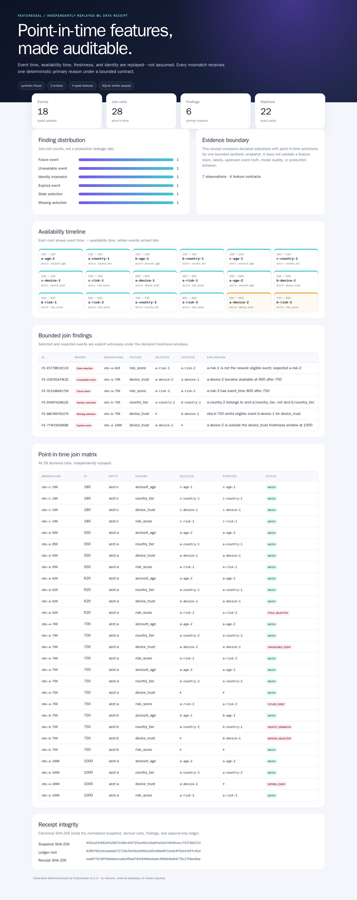
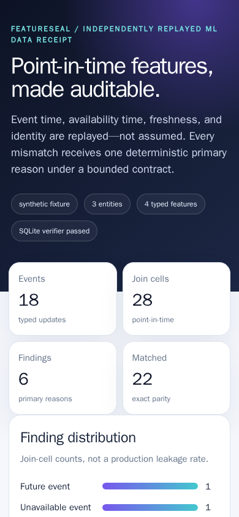

# FeatureSeal

**Deterministic point-in-time feature joins with temporal-leakage findings and independently replayable ML data receipts.**

Feature-store joins can look historically correct while quietly using an update that happened later, arrived later, belongs to another entity, exceeded freshness, or was not the newest eligible value. FeatureSeal turns those errors into a bounded, deterministic receipt that another implementation can replay.

The checked-in reference scenario is deliberately synthetic. Its numbers demonstrate behavior and reproducibility; they are not production leakage rates or model-quality claims.

## What is proved here

| Claim | Reproducible evidence |
|---|---|
| Exact point-in-time replay | 28 declared join cells: 22 matches and 6 findings |
| Complete reason coverage | One real fixture finding for each of the six primary rules |
| Algorithmic independence | Analyzer uses indexed reverse scans; verifier uses parameterized in-memory SQLite |
| Content integrity | Canonical snapshot, ledger root, and complete receipt SHA-256 digests |
| Cross-version support | CI exercises CPython 3.11.15, 3.12.13, 3.13.14, and 3.14.6 |
| Packaging | A clean wheel is installed and exercised outside the checkout |
| Visual truthfulness | Screenshots and GIF are regenerated from the real CLI/report in a networkless pinned browser |

## Workflow

1. A strict snapshot declares feature types, freshness windows, events, observations, and the selected event for every feature.
2. The analyzer derives the newest eligible event using both event time and availability time.
3. Every non-matching cell receives exactly one deterministic primary reason.
4. A canonical receipt binds normalized inputs, all cells, findings, and a 35-entry hash-chain ledger.
5. The verifier reconstructs the join through SQLite and rejects any field that does not replay exactly.

## Quick start

FeatureSeal has no third-party runtime dependencies.

    git clone https://github.com/omar07ibrahim/featureseal.git
    cd featureseal
    python -m venv .venv
    . .venv/bin/activate
    python -m pip install .

Run the complete reference workflow:

    featureseal analyze scenarios/late-feature-incident.json --output receipt.json
    featureseal verify receipt.json
    featureseal inspect receipt.json
    featureseal report receipt.json --output report.html

Expected summary:

    analyzed 18 events / 7 observations / 28 join cells
    findings 6; matched cells 22
    verified 28 cells with SQLite; 6 findings; 22 matched

Output files are created exclusively: FeatureSeal refuses to overwrite an existing receipt or report.

The complete machine-readable [CLI transcript](docs/evidence/featureseal-cli.txt), [receipt](docs/evidence/featureseal-receipt.json), and self-contained [HTML report](docs/evidence/featureseal-report.html) are tracked for review.

## Six deterministic primary reasons

Reason priority is intentional, so one bad cell never produces an ambiguous pile of labels.

| Reason | Meaning |
|---|---|
| <code>IDENTITY_MISMATCH</code> | Selected event belongs to another entity or feature |
| <code>FUTURE_EVENT</code> | Event time is after the observation |
| <code>UNAVAILABLE_EVENT</code> | Event existed historically but had not arrived by the observation |
| <code>EXPIRED_EVENT</code> | Event falls outside the declared freshness window |
| <code>STALE_SELECTION</code> | A newer eligible event should have been selected |
| <code>MISSING_SELECTION</code> | An eligible event exists but the declared selection is empty |

The reference fixture contains exactly one cell for each rule. Counts above describe this fixture only.

## Temporal contract

Event time answers “when did the fact occur?” Availability time answers “when could the feature pipeline actually know it?” A valid offline join must satisfy both constraints.

The witness above is derived from finding <code>FS-2287ECA79E1E</code>: <code>a-device-2</code> occurred at 650 but became available at 900, so observation 700 must use <code>a-device-1</code>.

Every one of the 18 event marks comes from the checked-in snapshot. Amber spans show genuine event-time-to-availability lag in that fixture.

## Independent verification

The production analyzer and verifier deliberately do not share a join implementation:

| Analyzer | Verifier |
|---|---|
| Groups by entity and feature | Creates an in-memory relational table |
| Sorts by event time | Uses parameterized SQL predicates |
| Bisects to the observation boundary | Orders eligible rows in SQL |
| Reverse-scans bounded candidates | Applies freshness and availability in the query |
| Builds findings and ledger | Rebuilds every cell, finding, summary field, and ledger entry |

The verifier does not import <code>analyze</code>, <code>join</code>, <code>engine</code>, or <code>ledger</code>. Agreement therefore catches more than serialization drift. See [Architecture and trust boundaries](docs/architecture.md).

## Receipt integrity

The current source-bound reference artifact exposes these exact digests:

| Material | SHA-256 |
|---|---|
| Normalized snapshot | <code>62b1a23c692afa29871346cd167151ed5e124abfacb2e7bb30cacc747fdd2113</code> |
| Ledger root | <code>820875811bcaeebd271724b7b42b2e6961e345c69eb9f22edc8f52e418ffc62d</code> |
| Complete receipt | <code>ead8f767d0f8e8da4cca8a459a878319490eebadc4568d4bd04776c1758ee8ae</code> |

The [evidence manifest](docs/evidence/featureseal-evidence.json) additionally binds 21 source records, generation tool versions, 12 rendered artifacts, byte counts, image dimensions, GIF frame count, and every file digest.

## Evidence gallery

<table>
<tr>
<td width="60%"></td>
<td width="40%"> Same verified report at 390 × 844.</td>
</tr>
</table>

All visuals are regenerated by GitHub Actions from the installed CLI. Browser capture uses Chromium 151.0.7922.34 inside a digest-pinned Playwright container with networking disabled and the source mounted read-only. See [Evidence lifecycle](docs/evidence.md).

## Bounded input contract

FeatureSeal rejects ambiguous or unbounded inputs before analysis:

- strict UTF-8 JSON with duplicate keys and non-finite numbers rejected;
- snapshots limited to 1 MiB and receipts to 4 MiB;
- at most 16 features, 512 events, and 128 observations;
- scalar types limited to boolean, integer, finite number, or bounded string;
- unique IDs and unique entity/feature/event-time coordinates;
- every observation declares a selection for every feature;
- availability may not precede event time;
- deterministic normalization and canonical JSON encoding.

These bounds make worst-case work and receipt size reviewable. They are a product contract, not accidental implementation limits.

## Quality gates

The main CI pipeline enforces:

- Ruff lint and format checks;
- strict mypy over source and tests;
- 73 deterministic tests with 97.51% line coverage;
- compatibility on four exact CPython versions;
- clean wheel contents and an external consumer install;
- a clean Git tree after every job.

The evidence pipeline separately enforces source binding, hash-locked browser wheels, an immutable container digest, networkless raster capture, exact dimensions, three distinct GIF frames, SVG structure, sensitive-marker scanning, and independent receipt replay.

## Repository map

    src/featureseal/       bounded runtime, analyzer, report, SQLite verifier
    scenarios/             deterministic point-in-time reference fixture
    tests/                 contract, join, CLI, report, and tamper tests
    tools/                 source-bound visual evidence generator
    docs/evidence/         real generated outputs and manifest
    legacy/                byte-preserved original 2022 profile stub

This repository began as Omar Ibrahim’s 2022 GitHub profile stub. The original 82-byte README is preserved byte-for-byte with its [manifest](legacy/original-profile-2022/manifest.json); the portfolio project was built in a linear, auditable commit history without erasing that origin.

## Documentation

- [Architecture and trust boundaries](docs/architecture.md)
- [Evidence lifecycle and reproduction](docs/evidence.md)
- [Security policy](SECURITY.md)
- [Contributing guide](CONTRIBUTING.md)
- [Changelog](CHANGELOG.md)

## License

Apache-2.0 © Omar Ibrahim. See [LICENSE](LICENSE) and [NOTICE](NOTICE).
