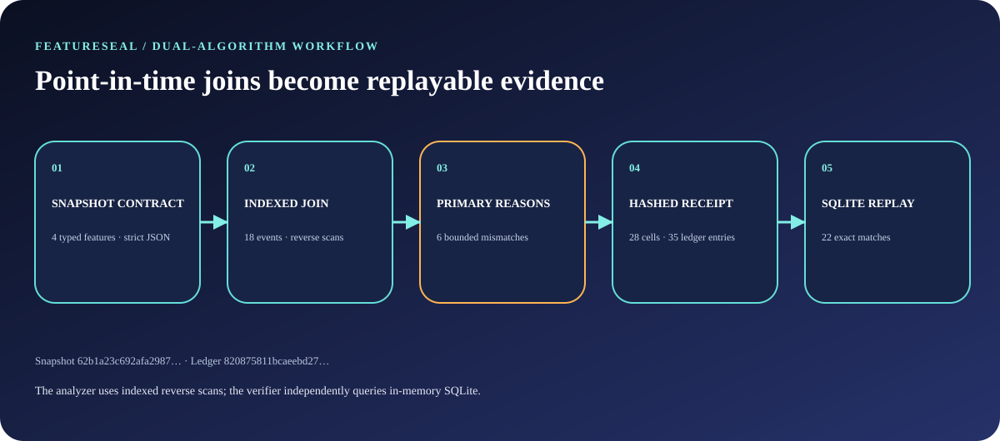
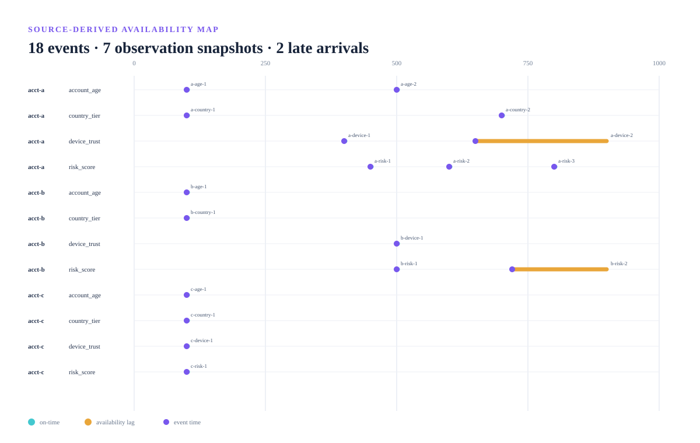

# Architecture and trust boundaries

FeatureSeal is a deliberately small data-engineering system: a zero-dependency Python runtime produces a point-in-time feature receipt, while a structurally different verifier decides whether that receipt is trustworthy.

## System boundary

The trusted input is one bounded snapshot. It contains:

- feature specifications: name, scalar type, and maximum age;
- feature events: identity, event time, availability time, value, and source;
- observations: entity, timestamp, and one declared selection per feature.

FeatureSeal does not contact a feature store, database, model endpoint, or network service. It evaluates only this declared snapshot. Upstream truth, label correctness, training quality, and production behavior remain outside the claim boundary.

## Analyzer path

The analyzer normalizes the snapshot, groups events by entity and feature, and sorts each group by event time. For each observation/feature pair it bisects to the observation boundary and scans backward through the bounded candidate group until it finds the newest event satisfying:

    event.entity == observation.entity
    event.feature == feature.name
    event.event_time <= observation.at
    event.available_time <= observation.at
    observation.at - event.event_time <= feature.max_age_seconds

The declared selection is compared with that expected event. Classification has a fixed priority:

    IDENTITY_MISMATCH
    FUTURE_EVENT
    UNAVAILABLE_EVENT
    EXPIRED_EVENT
    STALE_SELECTION
    MISSING_SELECTION

This ordering creates one stable primary explanation per cell. Finding IDs are content-derived from canonical finding bodies.

## Independent verifier path

The verifier intentionally does not import the analyzer, indexed selector, engine, or ledger modules. It:

1. validates the embedded snapshot against the public contract;
2. inserts event coordinates into an in-memory SQLite table;
3. derives each expected event with a parameterized query;
4. independently classifies every cell;
5. rebuilds findings, summary counts, and the complete ledger;
6. reconstructs the receipt digest and compares every public field.

The shared surface is the input/output contract, not the algorithm. A bug in reverse scanning is therefore less likely to be repeated by SQL replay.

## Receipt model

A receipt contains:

| Field | Purpose |
|---|---|
| <code>snapshot</code> | Normalized complete input |
| <code>snapshot_sha256</code> | Canonical snapshot commitment |
| <code>cells</code> | Every observation/feature comparison |
| <code>findings</code> | Content-addressed primary mismatches |
| <code>summary</code> | Exact counts and ordered rule distribution |
| <code>ledger</code> | Hash-chain of features, events, observations, and findings |
| <code>ledger_root_sha256</code> | Final append-only chain root |
| <code>receipt_sha256</code> | Commitment to every receipt field above |

Canonical JSON uses sorted keys, UTF-8, compact separators, and finite values. Parsing rejects duplicate keys before they can collapse into an ambiguous object.

## Complexity and bounds

Let E be events, O observations, and F feature definitions. Model normalization and group sorting are O(E log E). Each cell performs a binary search plus a bounded reverse scan within one entity/feature group. The contract caps E at 512, O at 128, and F at 16, so worst-case behavior and output volume remain explicit.

The SQLite verifier favors independence and clarity over sharing analyzer optimizations. It executes one parameterized lookup for each of at most O × F cells.

## Threat model

FeatureSeal is designed to detect and reject:

- future, unavailable, expired, stale, missing, and cross-identity selections;
- receipt tampering, omitted/extra fields, reordered or changed ledger material;
- duplicate JSON keys, non-finite numbers, invalid UTF-8, and oversized files;
- implicit overwrite of existing CLI outputs;
- evidence drift from source or renderer changes;
- credential-like markers and machine-specific paths in tracked evidence.

It does not claim to protect against a malicious Python interpreter, compromised CI runner, falsified upstream events, or a repository administrator rewriting Git history.

## Evidence supply chain

The evidence workflow separates application execution from browser rendering:

1. CPython 3.14.6 installs the hash-locked quality environment and package.
2. The installed CLI builds and verifies the real fixture receipt and report.
3. CPython 3.12.3 downloads five hash-locked browser wheels.
4. A digest-pinned linux/amd64 Playwright image runs Chromium with no network, a read-only source mount, dropped capabilities, bounded resources, and no privilege escalation.
5. CPython 3.14.6 finalizes the manifest and independently replays the candidate bundle.
6. Evidence is synchronized only on a same-repository pull request and committed as Omar Ibrahim.

The manifest’s <code>source_revision</code> is the latest commit that changed an evidence input; <code>source_tree</code> binds that commit’s complete tree. Per-file SHA-256 records make the narrower evidence dependency set explicit.

## Design trade-offs

FeatureSeal uses a complete snapshot instead of querying live systems. That makes replay deterministic and reviewable but requires adapters outside this repository for production data sources.

The receipt embeds normalized input, which increases size but makes it self-contained. Strict limits keep this cost bounded.

One primary reason per cell makes dashboards and incident triage stable. Secondary symptoms remain inferable from the selected and expected witness events.
